# PPTist JSON 转换器架构设计文档

## 1. 概述

PPTist JSON 转换器是一个专门为 [PPTist](https://github.com/pipipi-pikachu/PPTist) 演示文稿编辑器设计的 PowerPoint 到 JSON 格式转换工具。本系统采用服务导向架构，通过依赖注入实现模块化和可测试性，提供像素级精确的转换能力。

### 1.1 项目标识
- **包名**: `pptx2pptistjson`
- **版本**: v2.1.0
- **主要目标**: PPTist 兼容的 JSON 输出格式，像素级精确转换
- **架构模式**: 全栈 Next.js 应用，模块化服务导向转换引擎

## 2. 整体架构设计

### 2.1 系统架构图

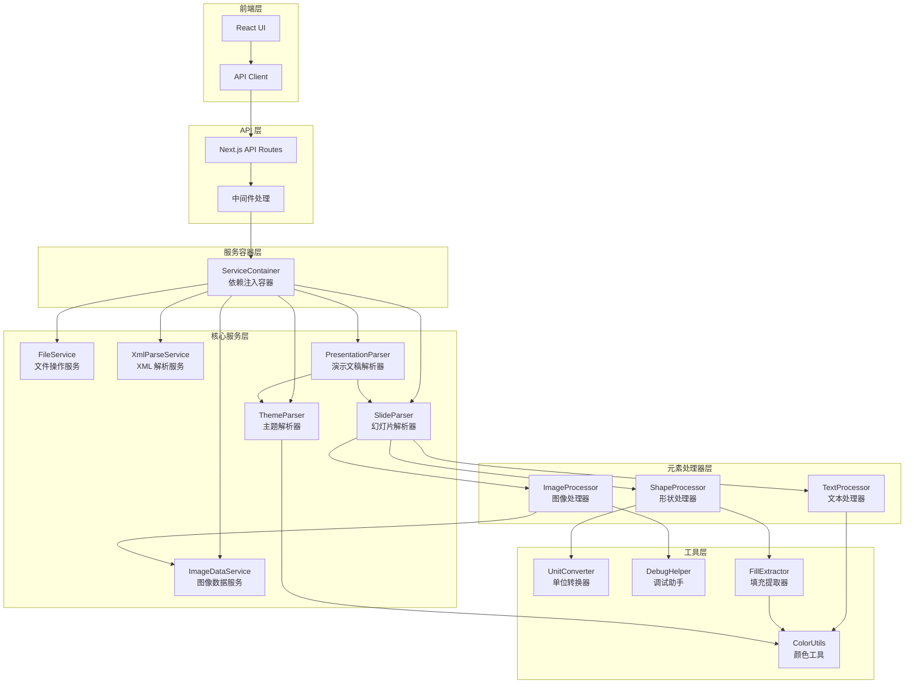

### 2.2 数据流图

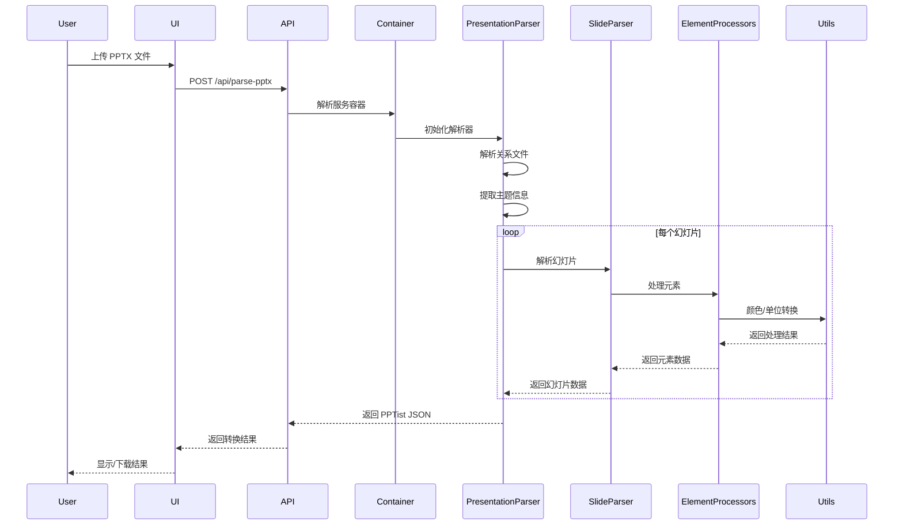

## 3. ServiceContainer 依赖注入模式

### 3.1 设计原理

ServiceContainer 实现了控制反转（IoC）和依赖注入（DI）模式，提供以下核心功能：

```typescript
interface IServiceContainer {
    // 注册单例服务
    register<T>(name: string, instance: T): void;
    
    // 注册工厂函数
    registerFactory<T>(
        name: string, 
        factory: () => T, 
        isSingleton: boolean = false
    ): void;
    
    // 解析服务
    resolve<T>(name: string): T;
    
    // 检查服务是否已注册
    has(name: string): boolean;
}
```

### 3.2 服务注册流程

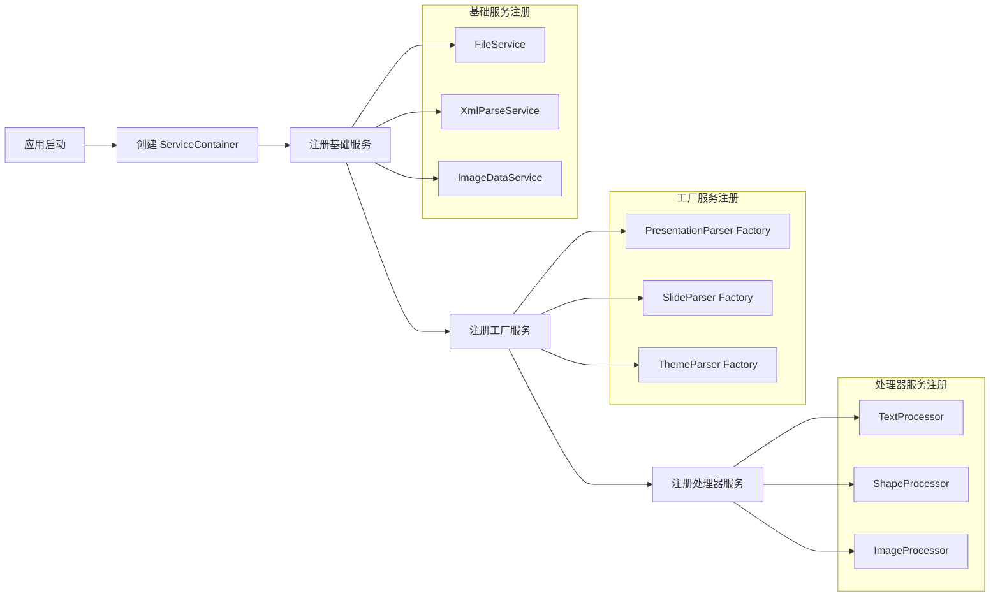

### 3.3 依赖注入优势

1. **解耦合**: 服务之间通过接口依赖，而非具体实现
2. **可测试性**: 易于创建模拟对象进行单元测试
3. **可扩展性**: 新增服务无需修改现有代码
4. **配置灵活**: 运行时动态配置服务实现

## 4. 核心服务组件详解

### 4.1 FileService - 文件操作服务

**职责**：
- ZIP 文件解压和处理
- 文件路径管理
- 二进制数据处理

**接口定义**：
```typescript
interface IFileService {
    loadZip(data: ArrayBuffer): Promise<JSZip>;
    extractFile(zip: JSZip, path: string): Promise<string>;
    extractBinary(zip: JSZip, path: string): Promise<ArrayBuffer>;
    listFiles(zip: JSZip, pattern?: RegExp): string[];
}
```

### 4.2 XmlParseService - XML 解析服务

**职责**：
- PPTX XML 文件解析
- 命名空间处理
- DOM 操作封装

**接口定义**：
```typescript
interface IXmlParseService {
    parseXml(content: string): Document;
    querySelector(node: Node, selector: string): Element | null;
    querySelectorAll(node: Node, selector: string): Element[];
    getAttribute(element: Element, name: string): string | null;
    handleNamespaces(xml: string): string;
}
```

### 4.3 ImageDataService - 图像数据服务

**职责**：
- 图像格式检测（JPEG, PNG, GIF, BMP, WebP, TIFF）
- Base64 编码转换
- 图像元数据提取
- 并发处理控制

**接口定义**：
```typescript
interface IImageDataService {
    extractImageData(
        zip: JSZip, 
        imagePath: string,
        mode: 'base64' | 'url'
    ): Promise<ImageData>;
    
    detectImageFormat(data: ArrayBuffer): string;
    
    processBatch(
        images: ImageRequest[],
        concurrency?: number
    ): Promise<ImageData[]>;
}
```

### 4.4 PresentationParser - 演示文稿解析器

**职责**：
- 主协调器角色
- 关系文件解析
- 主题解析协调
- 幻灯片集合管理

**核心流程**：
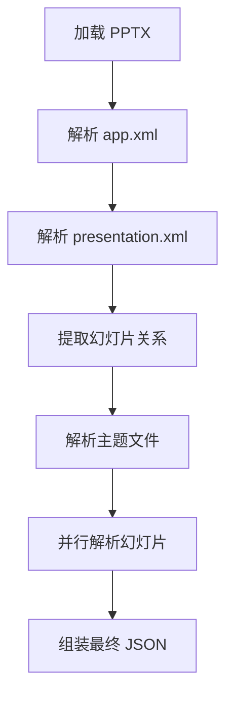

### 4.5 SlideParser - 幻灯片解析器

**职责**：
- 单个幻灯片解析
- 元素识别和分发
- 背景处理
- 布局应用

**处理流程**：
1. 解析幻灯片 XML
2. 提取背景信息
3. 识别和处理形状元素
4. 处理文本框
5. 处理图像
6. 应用主题样式

### 4.6 ThemeParser - 主题解析器

**职责**：
- PowerPoint 主题解析
- 颜色方案映射
- 字体方案提取
- PPTist 格式转换

**主题映射**：
```typescript
PowerPoint 主题颜色 --> PPTist 颜色方案
- dk1 (Dark 1) --> --black
- lt1 (Light 1) --> --white  
- dk2 (Dark 2) --> --gray-900
- lt2 (Light 2) --> --gray-100
- accent1-6 --> --theme-color
- hlink --> --primary
- folHlink --> --purple
```

## 5. 颜色处理管道

### 5.1 颜色处理流程图

```mermaid
graph TD
    A[颜色输入] --> B{颜色类型判断}
    B -->|RGB/RGBA| C[直接转换]
    B -->|HEX| D[HEX 转 RGBA]
    B -->|HSL| E[HSL 转 RGBA]
    B -->|主题颜色| F[主题颜色解析]
    
    F --> G[获取基础颜色]
    G --> H[应用颜色变换]
    
    H --> I[Alpha 透明度]
    I --> J[HueMod 色相调整]
    J --> K[LumMod/LumOff 亮度]
    K --> L[SatMod 饱和度]
    L --> M[Shade 加深]
    M --> N[Tint 减淡]
    
    C --> O[统一 RGBA 输出]
    D --> O
    E --> O
    N --> O
    
    O --> P[rgba() 格式字符串]
```

### 5.2 颜色变换算法

**PowerPoint 颜色变换顺序**（必须严格遵守）：

1. **Alpha (透明度)**
   ```typescript
   alpha = originalAlpha * (alphaMod / 100000)
   ```

2. **HueMod (色相旋转)**
   ```typescript
   hue = (originalHue + hueMod) % 360
   ```

3. **LumMod/LumOff (亮度调整)**
   ```typescript
   luminance = originalLum * (lumMod / 100000) + (lumOff / 100000)
   ```

4. **SatMod (饱和度调整)**
   ```typescript
   saturation = originalSat * (satMod / 100000)
   ```

5. **Shade (加深)**
   ```typescript
   color = mix(color, black, shadePercent)
   ```

6. **Tint (减淡)**
   ```typescript
   color = mix(color, white, tintPercent)
   ```

### 5.3 FillExtractor 填充提取器

```mermaid
graph LR
    A[填充元素] --> B{填充类型}
    B -->|solidFill| C[提取纯色]
    B -->|gradFill| D[提取渐变]
    B -->|pattFill| E[提取图案]
    B -->|noFill| F[透明填充]
    
    C --> G[ColorUtils.toRgba]
    D --> H[渐变停止点处理]
    E --> I[图案颜色处理]
    
    G --> J[返回 rgba()]
    H --> J
    I --> J
    F --> K[返回 transparent]
```

## 6. 形状处理架构

### 6.1 形状识别和转换流程

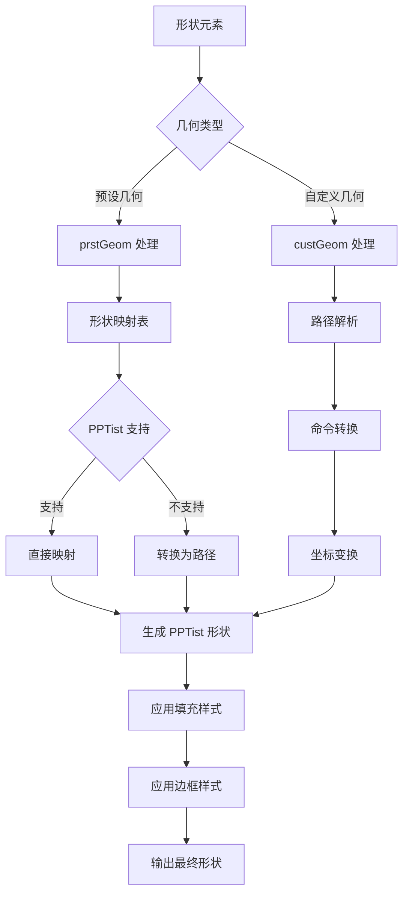

### 6.2 支持的预设形状

**基础形状**：
- rect (矩形)
- ellipse (椭圆)
- triangle (三角形)
- parallelogram (平行四边形)
- trapezoid (梯形)
- diamond (菱形)
- pentagon (五边形)
- hexagon (六边形)
- octagon (八边形)

**流程图形状** (flowChart 系列)：
- flowChartProcess (流程)
- flowChartDecision (决策)
- flowChartInputOutput (输入输出)
- flowChartPredefinedProcess (预定义流程)
- flowChartInternalStorage (内部存储)
- flowChartDocument (文档)
- flowChartMultidocument (多文档)
- flowChartTerminator (终止)
- flowChartPreparation (准备)
- flowChartManualInput (手动输入)
- flowChartManualOperation (手动操作)
- flowChartConnector (连接器)
- flowChartOffpageConnector (页外连接器)
- flowChartPunchedCard (打孔卡)
- flowChartPunchedTape (打孔带)

**动作按钮** (actionButton 系列)：
- actionButtonHome (主页)
- actionButtonHelp (帮助)
- actionButtonInformation (信息)
- actionButtonForwardNext (前进/下一个)
- actionButtonBackPrevious (后退/上一个)
- actionButtonEnd (结束)
- actionButtonBeginning (开始)

### 6.3 自定义几何路径处理

**路径命令映射**：
```typescript
PowerPoint 命令 --> SVG 路径命令
- moveTo (M) --> M x y
- lineTo (L) --> L x y
- cubicBezTo --> C x1 y1 x2 y2 x y
- quadBezTo --> Q x1 y1 x y
- arcTo --> A rx ry x-axis-rotation large-arc-flag sweep-flag x y
- close --> Z
```

**坐标转换**：
```typescript
// EMU 到点的精确转换
points = emu * 0.0007874015748031496

// ViewBox 缩放
scaleX = targetWidth / viewBoxWidth
scaleY = targetHeight / viewBoxHeight
```

## 7. 图像处理管道

### 7.1 图像处理流程

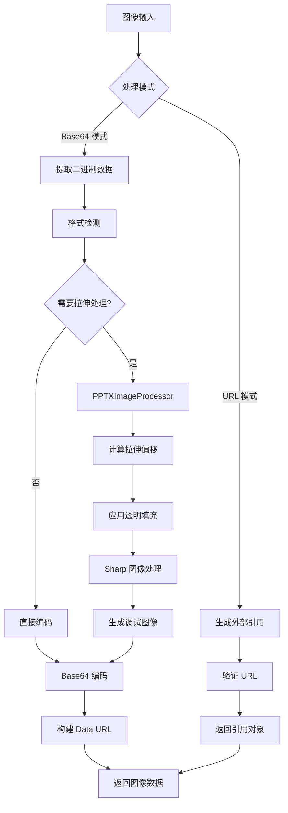

### 7.2 PPTXImageProcessor 拉伸偏移处理

**PowerPoint 拉伸算法实现**：

```typescript
interface StretchOffset {
    left: number;   // 左边裁剪百分比
    top: number;    // 顶部裁剪百分比
    right: number;  // 右边裁剪百分比
    bottom: number; // 底部裁剪百分比
}

// 处理流程
1. 解析 fillRect 元素获取拉伸参数
2. 计算实际裁剪区域
3. 处理负值偏移（添加透明填充）
4. 应用 Sharp 进行图像处理
5. 输出处理后的图像
```

### 7.3 并发处理控制

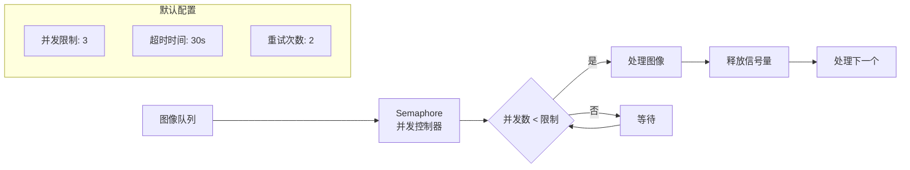

## 8. 单位转换系统

### 8.1 单位体系

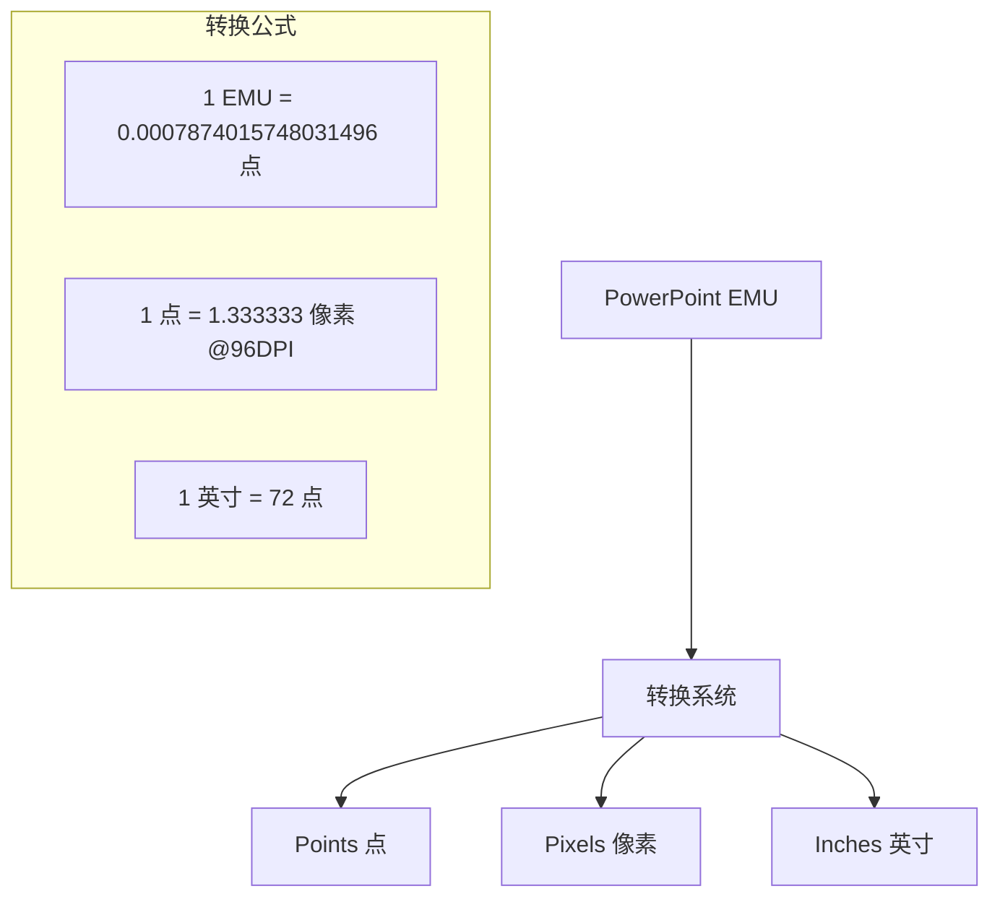

### 8.2 精度控制

```typescript
interface ConversionOptions {
    precision: number;  // 小数位数，默认 2
    roundingMode: 'round' | 'floor' | 'ceil';  // 舍入模式
}

// 使用示例
const points = UnitConverter.emuToPointsPrecise(914400, {
    precision: 2,
    roundingMode: 'round'
}); // 返回 72.00
```

## 9. 调试系统架构

### 9.1 调试系统组件

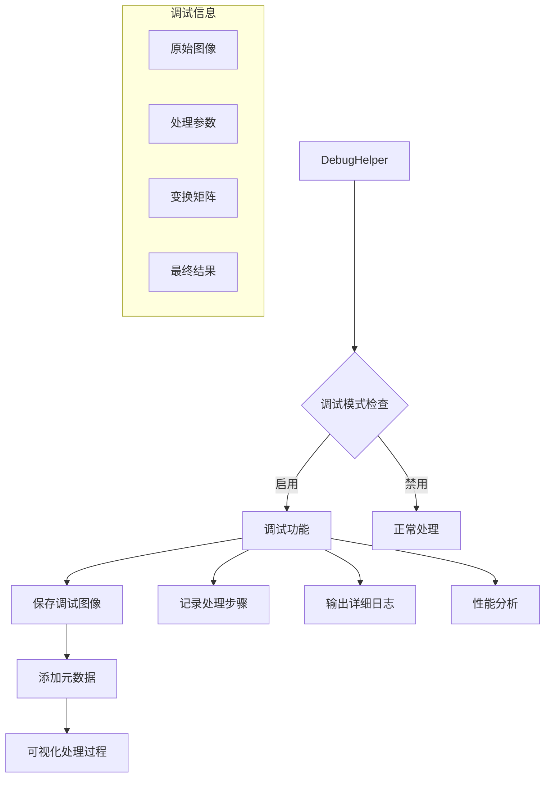

### 9.2 调试图像生成

```typescript
// 调试图像包含的信息
interface DebugImageMetadata {
    originalDimensions: { width: number; height: number };
    stretchOffsets: StretchOffset;
    processingSteps: string[];
    transformMatrix: number[][];
    timestamp: string;
}
```

## 10. 背景格式双模式支持

### 10.1 格式对比

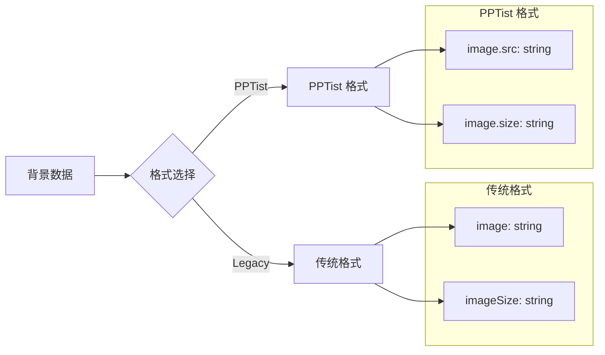

### 10.2 格式转换流程

1. **API 参数接收**: FormData 中的 `backgroundFormat` 参数
2. **解析器传递**: 通过整个转换管道传递格式参数
3. **Slide.toJSON()**: 根据格式参数生成对应结构
4. **向后兼容**: 默认使用 legacy 格式确保兼容性

## 11. 错误处理和容错机制

### 11.1 错误隔离策略

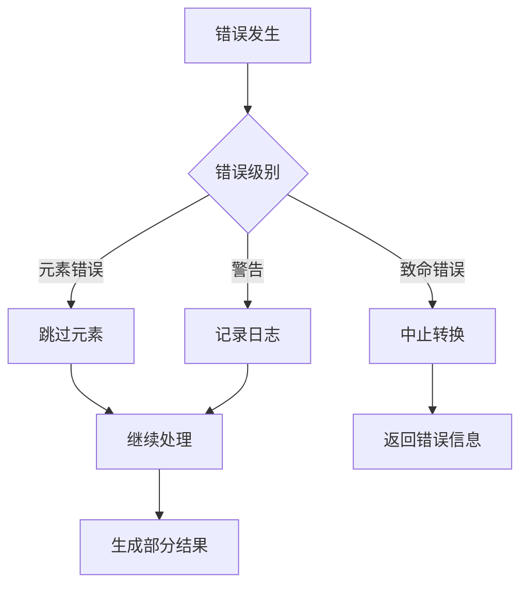

### 11.2 容错机制

1. **图像处理失败**: 返回占位符或跳过
2. **颜色解析失败**: 使用默认颜色
3. **形状转换失败**: 降级为矩形
4. **主题丢失**: 使用默认主题

## 12. 性能优化策略

### 12.1 并行处理

- 幻灯片并行解析
- 图像批量处理
- 异步 I/O 操作

### 12.2 内存管理

- 流式文件处理
- 及时释放大对象
- 使用 WeakMap 缓存

### 12.3 缓存策略

- 主题颜色缓存
- 图像处理结果缓存
- 路径计算缓存

## 13. 测试架构

### 13.1 测试分层

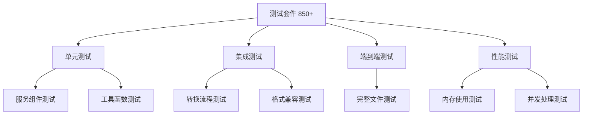

### 13.2 测试覆盖重点

1. **颜色处理**: 所有颜色格式和变换组合
2. **形状转换**: 100+ 预设形状的准确性
3. **图像处理**: 各种格式和拉伸偏移场景
4. **背景格式**: Legacy 和 PPTist 双格式验证
5. **边界情况**: 空值、异常输入、大文件

## 14. 关键设计决策

### 14.1 为什么选择服务导向架构？

1. **模块化**: 每个服务职责单一，易于维护
2. **可测试性**: 依赖注入使得单元测试更简单
3. **可扩展性**: 新功能可以作为新服务添加
4. **解耦合**: 服务之间通过接口通信

### 14.2 为什么强制使用 rgba() 格式？

1. **PPTist 兼容性**: PPTist 内部使用 rgba 格式
2. **透明度支持**: 统一处理透明度
3. **一致性**: 避免格式转换错误
4. **调试友好**: rgba 格式直观易读

### 14.3 为什么使用双背景格式？

1. **向后兼容**: 保护现有集成不受影响
2. **渐进迁移**: 允许用户逐步升级
3. **灵活性**: 不同场景选择合适格式
4. **未来扩展**: 为新格式预留空间

### 14.4 为什么采用 Sharp 进行图像处理？

1. **性能优越**: 基于 libvips，处理速度快
2. **内存效率**: 流式处理大图像
3. **功能丰富**: 支持复杂的图像变换
4. **稳定可靠**: 广泛使用的成熟库

## 15. 未来扩展方向

1. **支持更多元素类型**: 视频、音频、SmartArt
2. **实时协作**: WebSocket 支持多人编辑
3. **云端处理**: 分布式转换服务
4. **AI 增强**: 智能布局优化和内容建议
5. **性能优化**: WebAssembly 加速关键路径

## 16. 总结

PPTist JSON 转换器通过精心设计的服务导向架构，实现了 PowerPoint 到 PPTist 格式的高保真转换。系统的模块化设计、完善的错误处理、丰富的调试支持和全面的测试覆盖，确保了转换的准确性和可靠性。双格式支持策略既保证了向后兼容，又为未来发展预留了空间。